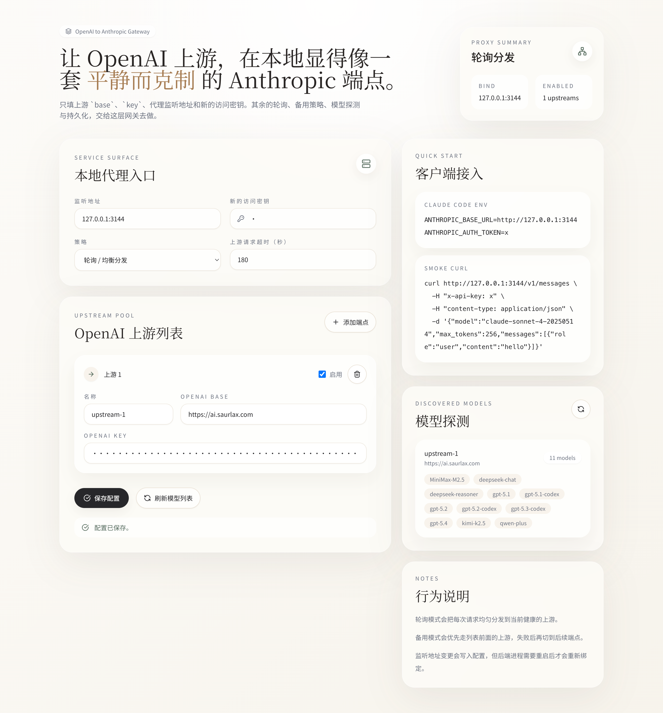

# OpenAI2Anthropic



一个更轻量的本地协议转换网关：

- 输入多个 OpenAI 兼容上游 `baseUrl + apiKey`
- 暴露 Anthropic 兼容的 `/v1/messages`
- 支持 `round_robin` 和 `failover`
- 配置持久化到 `data/config.json`
- 前端配置台在 [`frontend`](./frontend)

## 后端能力

- `GET /health`
- `GET /api/config`
- `PUT /api/config`
- `GET /api/models`
- `GET /v1/models`
- `POST /v1/messages`
- `POST /v1/messages/count_tokens`

当前实现重点支持：

- Anthropic Messages API 转 OpenAI Chat Completions
- 非流式响应转换
- SSE 流式文本和 tool call 增量转换
- 上游模型探测和简单自动映射

## 启动后端

```bash
go run .
```

默认监听 `127.0.0.1:3144`。实际监听地址由 `data/config.json` 控制。

## 启动前端

```bash
cd frontend
npm install
npm run dev
```

Vite 会把 `/api`、`/health` 和 `/v1` 代理到 `http://127.0.0.1:3144`。

## Claude Code 示例

```bash
ANTHROPIC_BASE_URL=http://127.0.0.1:3144
ANTHROPIC_AUTH_TOKEN=your-new-key
```

## 说明

- 修改监听地址后，需要重启后端进程才能重新绑定新地址。
- 当前没有把前端静态资源嵌入 Go 二进制；开发时建议前后端分开跑。
